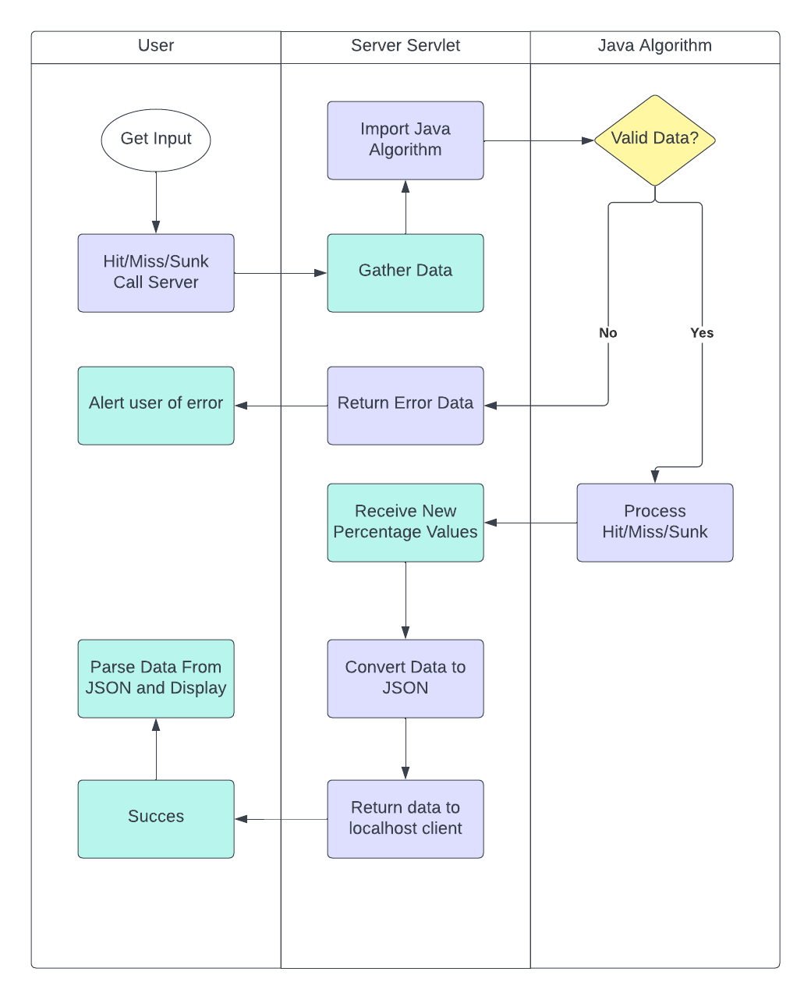

# Design Specifications Document

### We will create an html website that handles user UI

The website will be a standard html, css, jvs file containing all UI information

### We will create a java program that calculates the values of the board

The java file will preform all calculations necessary for finding the next best move and
will operate at a timely manner

### We will create an Apache Tomcat server that allows the html website and the java program to communicate

- The Tomcat server will be started on the users local machine
- The server will display the html webpage to the user
- User miss, hit, and hit & sunk actions will be read by JQuery and sent to the servlet on the tomcat server
- The server will process the recieved data using the java program
- The servlet will convert the output data to a JSON
- Any data to be sent back will be recieved by JQuery, parsed from a JSON, and then displayed on the html webpage

### Swimlane Diagram

