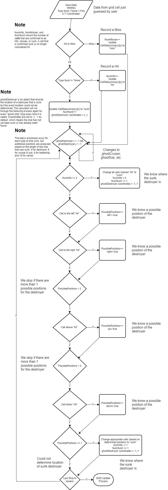

# Design Specifications Document

### R1. The user shall be able to view a battleship grid

* The website will be a standard html, css, jvs file containing all UI information
	- (include mockup of front end here)

### R2. The user shall be able to update the game board

- (describe how this is implemented)

### R3. The user shall be guided where to play next

- The java file will preform all calculations necessary for finding the next best move and will operate at a timely manner

* R3a. The ProbabilityCalculator class will take in info from the user's last guess
	- The ProbabilityCalculator will be implemented as a java class that has a public method called calculate which accepts the following info as arguments: Bool Hit, typeSunk (none, destroyer, cruiser, sub, battleship, carrier), x (0 = left) coordinate, y (0 = top) coordinate

* R3b. The ProbabilityCalculator will update the status of the game state to the best of its ability given current info
	- The calculator records and updates number miss/hit/sunk and keeps a 2d status array corresponding to the game board.
	- If the guess sunk a ship, the calculator will attempt to narrow down the exact position of the sunk ship and update the status of those cells.

### Board State Update Diagram

* R3c: The ProbabilityCalculator will calculate the probabilities of landing a hit on each unguessed cell and return them as an array
  	- (describe how this is implemented)
  	- (include diagram here)

	

### R4. The board shall restart after a page reset

* R4a. The board will reset when the page is refreshed
	- (describe how this is implemented)

### R5. The system shall use a server to connect back end javascript to the html

* We will create an Apache Tomcat server that allows the html website and the java program to communicate
	- The Tomcat server will be started on the users local machine
	- The server will display the html webpage to the user
	- User miss, hit, and hit & sunk actions will be read by JQuery and sent to the servlet on the tomcat server
	- The server will process the recieved data using the java program
	- The servlet will convert the output data to a JSON
	- Any data to be sent back will be recieved by JQuery, parsed from a JSON, and then displayed on the html webpage

### Server Swimlane Diagram

